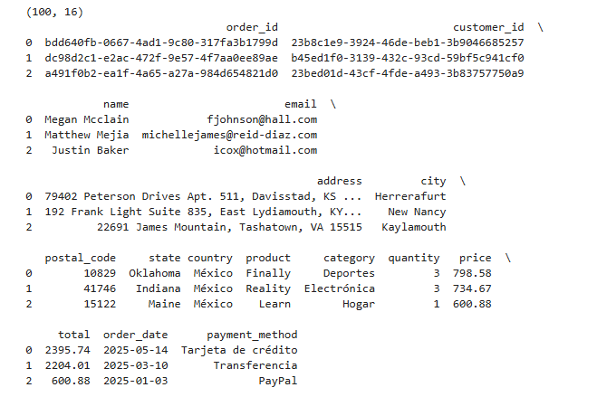
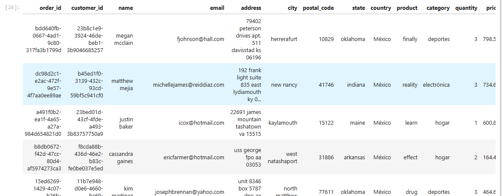
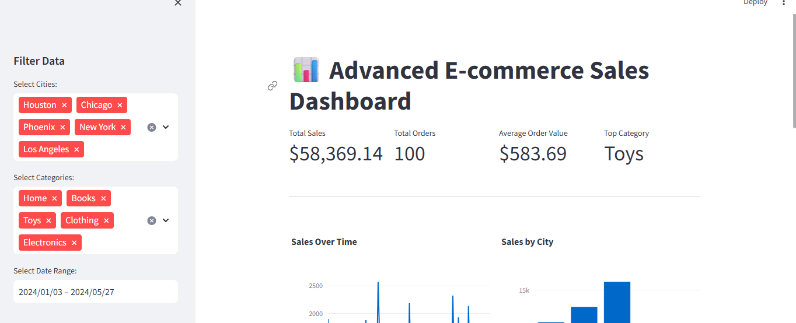

# 🧹 Data Cleaning & KPI Dashboard – E-Commerce Dataset

This project demonstrates how to clean raw e-commerce data and extract key business insights using Python. It includes two main components:

- 📊 Data Cleaning with Pandas
- 📈 KPI Dashboard Generation (Sales, Orders, Revenue, and more)

---

## 📁 Files and Structure

---

## 🛠️ Technologies Used

- Python (Pandas, Matplotlib, Plotly)
- Jupyter Notebook
- Data wrangling and transformation
- Basic dashboard creation

---

## 📌 Highlights

- Cleaned missing values, duplicates, and incorrect types
- Generated KPIs for:
  - Total sales
  - Monthly revenue trends
  - Top-selling categories
- Visual dashboard with graphs

---

## 📷 Previews

---

## 📫 Contact

Feel free to contact me if you're interested in data cleaning or dashboard projects:
**Jonathan Santiago** – *Data Analyst*  
📧 jonathan.santiago.mendoza@gmail.com
